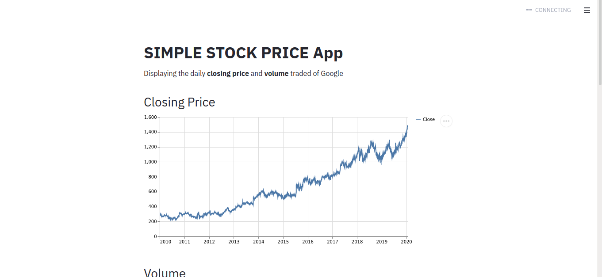

# SIMPLE STOCK PRICE APP

## This app displays the following historical stock price information:
- Daily Closing Price
- Daily Volume Traded
- Upcoming earnings events
- Recommendations

# How to run the app
- Type `streamlit run myapp.py` in your terminal to launch the web app in your browser.
- Type ticker symbol of stock in the input text box. Press CTRL+ENTER